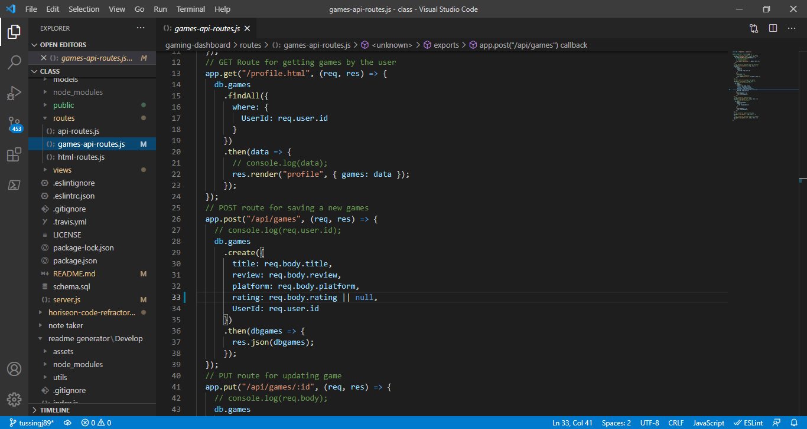
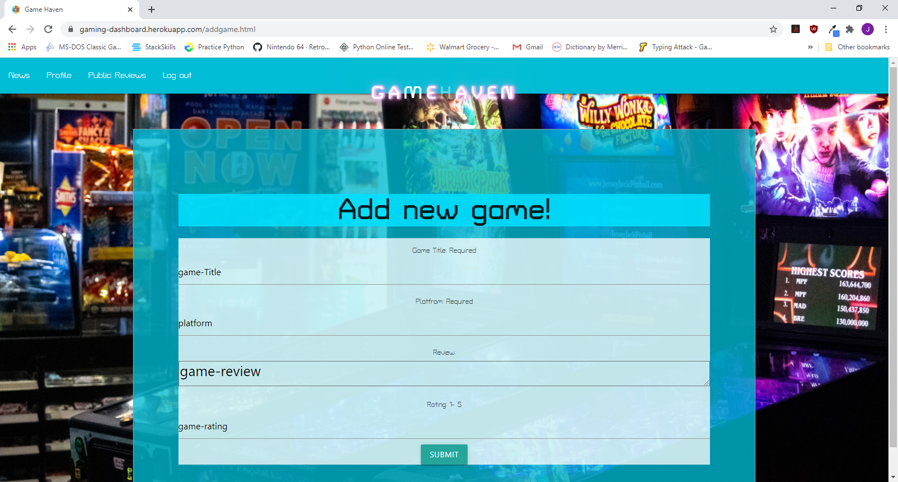

  
  # Gaming-Dashboard
 
  ## Description
  This project focuses on build a webpage where users can login, input games that they've played or games that they want to play, and read other users' reviews of games they have played. It was built using the MVC folder models, it has a MySQL database to store the webpage data, and it uses Sequelize.
  
  ## Table of Contents
  - [Title](#Title)
  - [Description](#description)
  - [Table of Contents](#table-of-contents)
  - [Screenshots](#screenshots)
  - [Installation](#installation)
  - [Usage](#usage)
  - [Testing](#testing)
  - [Additional Information](#additional-information)
  - [License](#license)
  - [Contributing](#contributing)
  - [Questions and Feedback](#questions-and-feedback)

  ## Installation
   Use of this application is very easy. Simply follow the link below and enjoy.
   https://gaming-dashboard.herokuapp.com/

  ## Usage
  This project's purpose is to allow gamers a place to store their game lists and read other gamers' reviews of games they have played.

  ## Technologies Used:
  Node, Sequelize, Express, Handlebars, ORMS, MYSQL, Heroku, and JAWSDB

  ## Code Sample
  In the sample code below, you can see how we used Sequelize ORMS to make calls to the database for creating and retrieving information.
  

  ## Screenshots
  

  ## License
  MIT License - see the [LICENSE.txt](https://github.com/tussingj89/Gaming-Dashboard/blob/main/LICENSE.txt) file for details.
  
  ## Testing 
  There is currently no test available.

  ## Contributing
  When contributing to this repository, please first discuss the change you wish to make via issue, email, or any other method with the owners of this repository before making a change.
  
  ## Questions and Feedback
  Please contact contributors using one of the following:
  -  Github: [tussingj89](https://gist.github.com/tussingj89)
  - Email: tussing40@gmail.com
  - Github:  [PonderHavok](https://gist.github.com/PonderHavok)
  - Email: transverseponderer@gmail.com
